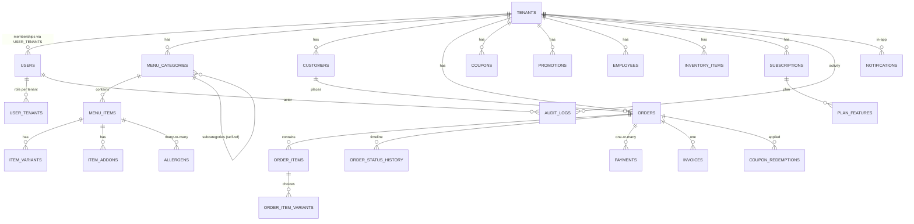

# Order Management System — V2.0: Production SaaS Restaurant Platform

**Vision:** Turn the v1 single-tenant order CRUD app into a commercial, multi-tenant restaurant ordering SaaS — "hundreds of restaurants in Dhaka" — with admin portal, restaurant workspaces, customer storefront, payments, analytics, and enterprise engineering throughout.

**Guiding rules:** no demo-quality code · incremental refactor with backward compatibility · no hard-coded restaurants/menus (data-driven with seed + import) · every feature integrates with the existing system and explains its reasoning.

---

## 1. Target Architecture

```
                        ┌──────────────────────────────────────────────┐
                        │                 Reverse Proxy                 │
                        │        (nginx/traefik — TLS, gzip, HSTS)      │
                        └───────────────┬───────────────┬───────────────┘
                                        │               │
              ┌─────────────────────────┴─────┐   ┌─────┴─────────────────────────┐
              │  Admin / Merchant Web App      │   │  Customer Storefront (public)  │
              │  React SPA (Vite, TS)          │   │  Same SPA, public routes        │
              └─────────────────────────┬─────┘   └─────┬─────────────────────────┘
                                        │  /api/v1 (JSON, Bearer/Refresh) │
                              ┌─────────▼───────────────────────────────▼─────────┐
                              │                 API (Node/Express, modular)        │
                              │  routes → controllers → services → repositories    │
                              │  middlewares: auth, tenant, rbac, validate,        │
                              │  rate-limit, request-id, audit, error-handler      │
                              │  (zod DTOs · OpenAPI · pino logs)                  │
                              └───────┬──────────────────────┬─────────────────────┘
                                      │                      │
                    ┌─────────────────▼─────────┐   ┌────────▼────────────────┐
                    │  PostgreSQL 16            │   │  Redis                  │
                    │  (tenants, catalog,       │   │  cache · rate-limit     │
                    │   orders, billing, audit) │   │  pub/sub · BullMQ queues│
                    └─────────────────┬─────────┘   └────────┬────────────────┘
                                      │                      │
                     ┌────────────────▼──────────────────────▼───────────────┐
                     │            Background Workers (BullMQ)                  │
                     │  notifications · invoices · image jobs · imports        │
                     └──────────────────────┬───────────────────────────────────┘
                                            │
              ┌─────────────────────────────▼──────────────────────────────┐
              │  Object storage (S3-compatible) + CDN — food images,       │
              │  receipts; signed uploads; sharp resizing pipeline          │
              └────────────────────────────────────────────────────────────┘
```

**Key architectural decisions (with reasoning)**

| Decision | Choice | Reasoning |
|---|---|---|
| Multi-tenancy model | **Shared database, row-level `tenant_id` scoping** (not schema-per-tenant, not DB-per-tenant) | For "thousands of restaurants" with moderate data volumes each, shared-schema is operationally simplest: one migration path, pooled connections, easy cross-tenant analytics for the admin portal. `tenant_id` on every business table + composite indexes + a **mandatory tenant-scoping middleware** (never trust the client: tenant comes from the session/claims, injected into every query). Hard isolation escape hatches (schema-per-tenant) can be added later for enterprise tiers — the tenant abstraction must support both. |
| Primary database | **PostgreSQL 16** (via Sequelize initially, typed SQL/Drizzle later) | Row-level concurrency (SQLite is single-writer), JSONB, `timestamptz`, rich indexing (GIN, FTS for search), managed backups. Keeps Sequelize for migration continuity from v1. |
| Cache/queue | **Redis** | Rate limiting (sliding window), menu/catalog cache, BullMQ for async jobs, pub/sub for live order events. |
| API style | **REST `/api/v1`, versioned from day one**; OpenAPI-generated docs | Backward-compatible growth; mobile apps + partner integrations later. v1 routes stay mounted under `/api` during migration. |
| Backend shape | **Modular monolith**: routes → controllers → services → repositories, DI composition root | Right-size for this team; avoid microservice complexity while keeping every layer testable and swappable. |
| Frontend | **React 18 → single SPA**, feature folders, shared UI kit (design tokens), TanStack Query + Zustand, React Router | One deployable; public storefront and merchant/admin share the design system; route-based code splitting keeps the storefront fast. |
| Money | **DECIMAL(12,2)** stored; integer *paisa* for gateway payloads | No float rounding in invoices/payments. |
| Images | S3-compatible + CDN, `sharp` resize pipeline, signed URLs | CDN-ready architecture; consistent editorial aspect ratio (e.g. 4:3 / 1:1) with blur-up placeholders. |
| Payments | **Gateway adapter interface** (`PaymentProvider`) + provider registry | SSLCommerz, bKash, Nagad, Rocket, Stripe plug in as adapters behind one interface; webhook verification per provider. |
| Auth | Access JWT (short) + rotating refresh token (httpOnly cookie), RBAC, optional TOTP | Revocable sessions, CSRF-safe (SameSite cookies), XSS-hardened. |
| Deploy | Docker Compose (dev/staging) → GitHub Actions → managed VPS or container service; nginx TLS; healthchecks | Repeatable, monitored, no secret baking. |

---

## 2. Multi-Tenancy Strategy (detail)

1. **`tenants` table** — `id`, `slug`, `name`, `logo_url`, `status` (active/trial/suspended/archived), `plan_id`, `settings` (JSONB: timezone, currency, features), audit columns, soft-delete.
2. **Tenant scoping** — every business table (`menus`, `menu_items`, `orders`, `customers`, `employees`, `coupons`, …) carries `tenant_id NOT NULL REFERENCES tenants`. A `requireTenant` middleware resolves the tenant from the authenticated claims (or public route from slug) and injects it; repositories accept `tenantId` explicitly — **no tenant filter can be forgotten** (repository layer defaults to filtering by it).
3. **Roles per tenant** — `user_tenants` join table (user ↔ tenant with `role`), users can belong to many workspaces; global `platform_admin` flag for the SaaS admin.
4. **Public storefront** — tenant resolved by slug/custom domain (future-ready: `Host` header → tenant lookup cached in Redis).
5. **Archival** — soft delete + `status='archived'`; archived tenants keep data (regulatory) but are excluded from queries.
6. **Import/seed** — no hard-coded restaurants: seed script + CSV/JSON import service (bulk insert with validation) + optional public API key for partners (HungryNaki-style integrations).

---

## 3. Target Data Model (ER — Mermaid)



Core tables for V2 (migrations land phase by phase):

- **Identity:** `users`, `user_tenants`, `refresh_tokens`, `verification_tokens`, `password_resets`, `login_attempts`
- **Tenancy/SaaS:** `tenants`, `plans`, `subscriptions`, `feature_flags`, `usage_counters`, `audit_logs`
- **Menu:** `menu_categories` (self-ref subcategories), `menu_items` (image_url, nutrition JSONB, ingredients, allergens, prep_minutes, availability, is_available), `item_variants` (size/price), `item_addons`, `item_allergens`
- **Customers:** `customers`, `favorites`, `reviews`
- **Orders:** `orders` (status enum, type pickup/delivery/scheduled, timestamps, delivery info, totals as DECIMAL), `order_items` (snapshot name/price), `order_item_options`, `order_status_history`, `invoices`
- **Promotions:** `promotions` (scoped to tenant + optional products/categories, caps), `coupons`, `coupon_redemptions`
- **Payments:** `payment_providers`, `payments` (provider, status, transaction refs), `payment_intents` (idempotency)
- **Ops:** `notifications`, `inventory_items`, `reports_cache`, `jobs`

---

## 4. Roadmap — 10 Phases

> Each phase: **Objectives · Deliverables · Dependencies · Estimated effort · Risks · Acceptance criteria.** Effort assumes a 2–3 engineer team. Phases ship sequentially; every phase ends with working, deployable software and docs updated.

---

### Phase 1 — Foundation

> **Status: ✅ Done, incl. the PostgreSQL stack (PRs #6 + #7 + #8).** Versioned migration runner (`npm run db:migrate` / `:down` / `:status`) + migrations 001–005 (identity/auth · tenancy/SaaS · menu catalog · orders/promotions · v1 field bridge), `pg` driver, dialect-selectable config (`DB_DIALECT`/`DATABASE_URL`), PostgreSQL 16 dev service in `docker-compose.yml`, a **PG-in-CI job** that runs `db:migrate` + the full suite against a real PostgreSQL 16, the **v1 → v2 data migration** (`npm run db:migrate:v1 -- --source <v1.sqlite>`, schema doc §8 — id maps, DECIMAL conversion, verification), **Sequelize models aligned to the migration DDL** (`tableName`/`field` mappings — `sync()` removed everywhere; migrations run at boot on both dialects), a **production cutover runbook** (`docs/04-pg-cutover-runbook.md`), and a **Playwright e2e tier in CI**.

**Objectives:** Make the repo production-grade before any feature work; fix the critical security holes; introduce the tooling every later phase depends on.

**Deliverables**
- Repo hygiene: `.gitignore`, `.editorconfig`, `.dockerignore`, `.nvmrc`, delete stray root `package-lock.json`
- **Purge secrets & DB from git history** (`backend/.env`, `backend/data.sqlite`); rotate JWT secret; add gitleaks to CI
- **PostgreSQL migration**: new `docker-compose` with `postgres` + `redis`; `sequelize` points to PG; write v1 → v2 data migration script (existing products/promotions/orders/items/users carried over under a default tenant)
- **Migration system** (replace `sync({alter:true})`): versioned migrations + `migrate` npm script; `sync` allowed in dev only
- Critical fixes: remove `seed-admin` (CLI seed instead), helmet, restricted CORS, `express-rate-limit`, global error handler + async wrapper, try/catch on GET routes, `npm audit fix` (express, sequelize, uuid, axios, react-router upgrades)
- Tooling: ESLint flat config + Prettier, Vitest harness (unit), supertest (API integration), Playwright (e2e smoke), GitHub Actions CI (`lint → test → build → audit`)
- Money → DECIMAL migration; basic pagination contract on existing routes
- Docs: `SETUP.md`, `docs/03-database-schema.md`

**Dependencies:** none (starts from v1).

**Effort:** ~2–3 weeks

**Risks:** PG migration data loss (mitigate: freeze DB, dry-run migration, restore drill); breaking the working v1 app (mitigate: keep v1 routes, feature-flag the PG switch).

**Acceptance criteria:** CI green; `npm audit` high/critical = 0; no secrets/DB in git; `docker compose up` runs API+DB+Redis with healthchecks; migrations apply cleanly on empty + existing data; existing features (products, promos, orders, login) pass e2e smoke on PG.

---

### Phase 2 — Authentication & RBAC

> **Status: ✅ Shipped (PR #2 — `feat/phase2-auth-rbac` → `master`).** Backend: full auth service, refresh rotation + reuse detection, RBAC middleware, tenant-scoping middleware, TOTP 2FA, email-verification/password-reset token flows, auth audit logging, permission-guarded business routes, 53 passing tests. Frontend: token-refresh interceptor, register/verify/forgot/reset pages, 2FA login step, session bootstrap.

**Objectives:** Secure, role-based, multi-workspace-ready auth.

**Deliverables**
- Roles: `platform_admin`, `owner`, `manager`, `cashier`, `kitchen`, `delivery`, `customer`; permission matrix; `requireRole`/`requirePermission` middleware
- Access token (15m) + rotating refresh token (httpOnly, SameSite cookie), session table with revocation, token rotation on reuse detection
- Email verification, password reset (short-lived single-use tokens), password policy (argon2), optional TOTP 2FA (otplib + QR)
- Login rate limiting + lockout; audit log of auth events
- `user_tenants` + current-tenant selection; `X-Tenant` scoping middleware skeleton (full enforcement in Phase 3)
- Notification adapter stubs (email via nodemailer/SES) to deliver verification/reset emails

**Dependencies:** Phase 1 (PG, error handling, validation).

**Effort:** ~3–4 weeks

**Risks:** Cookie/CSRF interplay with the SPA (mitigate: SameSite + CSRF token where needed); token rotation bugs locking users out (mitigate: reuse-detection grace window, tests).

**Acceptance criteria:** login/register/verify/reset/2FA flows e2e-tested; brute-force lockout proven; refresh rotation + revocation tests pass; every API route now enforces at least `authenticated`; no endpoint returns data across tenants (unit-tested via `user_tenants` fixtures).

---

### Phase 3 — Restaurant (Tenant) Management

> **Status: ✅ Shipped (PR #3 — `feat/phase3-tenant-workspaces` → `master`).** Backend: `tenants` / `plans` / `subscriptions` / `feature_flags` / `usage_counters` models + tenant workspace CRUD + team member invite/remove API, hardened fail-closed tenant-scoping middleware (`X-Tenant` header, suspended/archived blocking), every business route scoped by `tenant_id`, CSRF origin-check middleware for cookie-authenticated routes, and a role-switch fix (selected workspace's membership role now always wins over the login-time token role). Seed: idempotent `seed:restaurants` with 20 Dhaka brands + 89 menu items. Tests: dedicated tenant-isolation suite (cross-tenant 403/404, ID injection, archive blocks, role switching) + CSRF suite — 73 passing. Frontend: workspace switcher in the navbar, `X-Tenant` header in the API client, Wolt/Deliveroo-style theme.

**Objectives:** Multi-tenant workspaces — restaurants are data, not code.

**Deliverables**
- `tenants`, `plans`, `subscriptions`, `feature_flags`, `usage_counters` tables + CRUD + archive/suspend flows
- **Tenant scoping middleware hardened** across every route/repository (fail-closed: missing tenant → 403)
- Tenant onboarding: create workspace, invite owner, setup wizard data (default categories)
- **Seed data for Dhaka restaurant ecosystem** (KFC, Pizza Hut, Domino's, Chillox, Takeout, Sultan's Dine, Star Kabab, Madchef, Cheez, Herfy, BFC, Barcode, American Burger, Secret Recipe + partner-style entries) via **seed script — no hard-coded names in code**; each with realistic menus built from seed data
- **Import service**: CSV/JSON menu + restaurant import with validation and error report
- Tenant admin UI: workspace switcher, restaurant profile, team members (invite + role assignment)

**Dependencies:** Phase 2 (roles, sessions).

**Effort:** ~3–4 weeks

**Risks:** tenant-isolation leak (mitigate: dedicated security test suite asserting cross-tenant 404/403); seed data bloat (mitigate: idempotent, tagged seeds).

**Acceptance criteria:** 20+ Dhaka restaurants seedable with one command; isolation tests pass (tenant A cannot read/write tenant B — automated); invite/role flows e2e-tested; archive/suspend blocks access.

---

### Phase 4 — Menu Management

> **Status: ✅ Shipped (PR #5 core + PR #10 media/import/public-API).** Core: `menu_categories` (self-ref subcategories, sort order), `item_variants` (size/price adjustments), `item_addons` (paid extras) — all tenant-scoped and RBAC-gated (`view:menu` read, `manage:menu` write); `Products` extended with `category_id` / `prep_minutes` / `image_url`; menu router with category CRUD (self-parent & cross-tenant parent rejection, detach-on-delete), variant/add-on CRUD under a product with tenant ownership checks; `seed:restaurants` backfills categories, variants and add-ons idempotently. Deferred items shipped: **image pipeline** (`POST /api/uploads/images` — sharp → WebP standard + 320px thumbnail, MIME sniffing, size/dimension caps, cleanup on failure; local + S3-compatible drivers with CDN URLs, `DELETE` endpoint), **bulk CSV import** (`POST /api/products/import` — per-row validation, within-file + DB duplicates with `skip/error/update`, auto-category creation, batched transactions, partial success summary, template download), and the **public menu API** (`GET /api/public/restaurants/:slug[/menu]` — no auth, whitelist serialization, category + availability filters, hidden workspaces 404; demo storefront page at `/m/:slug`). Tests: 138 passing (SQLite + PostgreSQL). See [`docs/05-media-import-public-menu.md`](docs/05-media-import-public-menu.md).
>
> **Follow-up rounds shipped:** (1) **availability schedules** (`menu_items.available_from/to` — hidden from the storefront + `AVAILABILITY_WINDOW` at checkout, overnight/one-sided windows), **bulk edit** (`POST /api/products/bulk`), **category duplication**, **dietary/merch tags**, **drag-and-drop menu sort**, **variant-level stock** (enforce + decrement) and the **image-optimize UI** — migration 020; (2) **category drag-sort**, **variant low-stock alerts** (`low_stock_at`, migration 021) and the **availability preview calendar**; (3) **per-day availability overrides** (`availability_overrides`, migration 022 — date-specific closed/windowed overrides enforced on the storefront + checkout, scheduled-date aware, replace-all `GET/PUT /api/products/:id/overrides` + Product-form editor), **storefront scarcity cues** (public stock/low-stock serialization → “Only N left” / “Sold out” badges, sold-out variants disabled) and **menu bulk organize** (bulk `category_id` move + availability-window stamp); (4) **storefront-wide closure days** (`tenant_closure_dates` + `availability_weekday_rules`, migration 023 — one-off restaurant-wide closure dates and recurring weekday rules, restaurant-wide “closed every Saturday” toggles + per-item weekday rules in a Sun–Sat Product-form editor; the public menu returns a `closedToday` flag with a “We're closed today” banner and checkout rejects closed days including scheduled dates), **scarcity cues in checkout + cart** (sold-out lines blocked, low-stock chips) and the **scheduled-order availability preview** (`GET /api/public/restaurants/:slug/availability?date=&time=` — per-item availability + reason at an arbitrary instant; the checkout shows a live preview at the chosen datetime and blocks placement while items are unavailable); (5) **closure-conflict warnings** (`GET /api/tenants/:id/closure-conflicts` — items whose windowed override/weekday rule would open them on a closed day, surfaced in the Settings closure card before saving), the **storefront next-open countdown** (the closed menu payload computes `nextOpenAt` via a 14-day forward scan → “Back open {weekday} at {HH:MM}”) and the **per-dish availability calendar** (the availability API's **windows mode** — `?date=` returns each item's open segments that day — feeding a “Check times” button on every dish with a 7-day chip + hourly-slot modal). Full detail in the README delivery summary.

**Objectives:** Rich, data-driven menu per restaurant.

**Deliverables**
- ✅ Schema: categories (+subcategories self-ref), items extended with `category_id` / `prep_minutes` / `image_url`, variants (size + price), add-ons (option groups)
- ✅ CRUD APIs; **bulk CSV import** (validated, partial success, duplicates, template); optimistic locking on items (`version`) + soft delete still pending
- ✅ **Image pipeline**: sharp resize (standard + thumbnail) → WebP, MIME sniffing, size/dimension caps, cleanup on failure, S3-compatible + local drivers, CDN URL builder
- ✅ Merchant menu UI: category manager + item editor with variant/add-on builder + photo upload; allergen/nutrition editor pending
- ✅ Public menu API (read-only, whitelist fields) for the future storefront — Redis caching + ETags still pending for scale

**Dependencies:** Phase 3 (tenants), image storage setup.

**Effort:** ~3–4 weeks

**Risks:** complex item modeling over-engineering (mitigate: ship core variant/add-on first, extend later); image pipeline cost (mitigate: compression presets + CDN).

**Acceptance criteria:** menus with categories/subcategories/items/variants/add-ons/allergens create-edit-archive via UI and API; public menu API returns cached responses <100ms p95; images served via CDN URLs with lazy loading; import 500+ items in <30s with error report.

---

### Phase 5 — Ordering & Fulfillment

**Objectives:** End-to-end ordering: storefront → kitchen → delivery.

**Deliverables**
- Customer storefront: restaurant browse/search/filters, favorites, cart, checkout (pickup/delivery/scheduled), order tracking timeline
- Order system: status lifecycle (`placed → confirmed → preparing → ready → out_for_delivery → delivered | cancelled | rejected`), `order_status_history`, kitchen queue (WebSocket push via Redis pub/sub), accept/reject flows
- Idempotent order creation (`Idempotency-Key`); price snapshots on items; transaction + optimistic locking
- Invoice generation (PDF) + order confirmation emails
- Role-scoped order views: cashier (create), kitchen (queue), delivery (assigned), owner (all)
- Notifications: in-app (SSE/WS) + email/SMS adapter stubs for status events

**Dependencies:** Phase 2 (RBAC), Phase 4 (menu), Redis pub/sub.

**Effort:** ~4–5 weeks

**Risks:** WebSocket scale + reconnect storms (mitigate: Redis adapter, exponential backoff, event log replay); price/stock races (mitigate: transactions + version checks); scheduled orders (mitigate: BullMQ delayed jobs).

**Acceptance criteria:** full happy path (browse → cart → checkout → kitchen accepts → status updates → delivery) works e2e; duplicate-submit creates exactly one order; scheduled order fires on time; kitchen sees live queue updates; invoice PDF generated per order.

---

### Phase 6 — Payments

**Objectives:** Gateway-agnostic billing.

**Deliverables**
- `PaymentProvider` interface (`createIntent`, `verifyWebhook`, `capture`, `refund`, `status`) + provider registry
- **Adapter stubs + integration for SSLCommerz and bKash first** (Dhaka market), Nagad/Rocket/Stripe adapters behind the same interface (config-driven, no code change to add one)
- Payment flow: create intent → redirect/QR → webhook verify (signature validation) → confirm order; idempotency + reconciliation job (mark stale intents)
- Payment statuses on orders; partial/refund flows; invoices link payments
- Sandbox mode (test gateway credentials) for dev/staging

**Dependencies:** Phase 5 (orders), webhook-exposed API.

**Effort:** ~3–4 weeks

**Risks:** gateway sandbox quirks (mitigate: adapter tests against sandbox, contract per provider); double-charge (mitigate: idempotency keys + unique payment refs); webhook replay (mitigate: signature + nonce).

**Acceptance criteria:** payment via SSLCommerz sandbox completes and confirms order end-to-end; webhook replay/forgery rejected; refund flow works; adding a new provider = new adapter file + env config, zero order-flow changes.

---

### Phase 7 — Analytics & Dashboards

**Objectives:** Decision-grade dashboards.

**Deliverables**
- Analytics service: revenue, order counts, peak hours, best-selling items, avg order value, customer retention, delivery performance (per tenant, date-range filtered)
- Materialized/aggregated reporting: nightly rollup tables or Redis-cached queries; export CSV/PDF
- Charts (lightweight, lazy-loaded): revenue trend, category mix, heatmap of peak hours, funnel
- Restaurant dashboard: KPIs + live order panel + alerts (low stock, high cancellation)
- Admin-level cross-tenant revenue analytics

**Dependencies:** Phase 5 (order data), Phase 8 partial (admin shell).

**Effort:** ~3–4 weeks

**Risks:** query cost on large datasets (mitigate: rollups + indexes + caching); misleading KPIs (mitigate: define metrics with tests on fixtures).

**Acceptance criteria:** dashboards render <2s p95 on seeded 6-month dataset; all KPIs unit-tested against fixtures; CSV export works; caching invalidated on new orders.

---

### Phase 8 — Admin Portal & SaaS Ops

**Objectives:** Platform administration console.

**Deliverables**
- Admin shell: manage restaurants (create/edit/archive/import), users, plans & subscriptions (trial, billing cycles, upgrades), feature flags, usage limits enforcement (order caps, menu caps per plan)
- System health page: API/DB/Redis/workers status, error rates; audit log explorer; backup trigger + retention status
- Announcements/notifications to tenants; global search
- Audit logging: every admin action recorded (who/what/when)

**Dependencies:** Phases 2–3 (users/tenants/plans).

**Effort:** ~3–4 weeks

**Risks:** admin over-reach (mitigate: permission gates + audit trail + confirmation flows).

**Acceptance criteria:** admin can onboard/archive/suspend a restaurant with full audit trail; feature flags toggle without redeploy; usage limits block at plan boundaries; health page reflects real component states.

---

### Phase 9 — SaaS Hardening (Performance & Security)

**Objectives:** Make it fast, secure, and observable under load.

**Deliverables**
- Load testing (k6): peak-hour scenario (Dhaka lunch/dinner), target: API p95 < 300ms, storefront < 1.5s LCP
- Performance: query tuning (`EXPLAIN ANALYZE`), Redis caching pass, CDN cache headers, bundle budget + code splitting, compression, HTTP/2
- Security hardening: OWASP review pass, CSP + headers audit, secret scanning in CI, dependency bump automation (Renovate), pen-test checklist
- Observability: Sentry (errors), structured logs + Grafana/Loki, uptime checks, alerting
- Backup strategy: automated `pg_dump` + PITR, restore drills, object-storage lifecycle rules

**Dependencies:** Phases 1–8.

**Effort:** ~3 weeks

**Risks:** perf work is open-ended (mitigate: budgets + SLOs first); scope creep (mitigate: prioritize findings by severity).

**Acceptance criteria:** SLOs met under load test; 0 critical/high `npm audit`; restore drill completes RPO/RTO targets; alerts fire and page correctly in a game-day test.

---

### Phase 10 — Production Release

**Objectives:** Ship it for real customers.

**Deliverables**
- Production deployment: Terraform/Ansible or managed service, TLS, secrets manager, logging/monitoring, zero-downtime strategy
- Docs: `DEPLOYMENT.md`, `ADMIN_MANUAL.md`, `DEVELOPER_GUIDE.md`, final `docs/04-api.md` (OpenAPI), architecture doc
- Migration runbook + rollback plan; freeze checklist; staged rollout to pilot restaurants (data import validation)
- Support runbook, on-call setup, SLA/SLO definitions, incident template
- Go/no-go review

**Dependencies:** Phases 1–9.

**Effort:** ~2–3 weeks

**Risks:** deployment surprises (mitigate: staging parity + runbook rehearsals); post-launch incidents (mitigate: on-call + rollback ready).

**Acceptance criteria:** green-light checklist signed; pilot restaurants live and importing data; SLOs met for 2-week pilot; rollback drill executed; all required docs published.

---

## 5. Cross-Cutting Strategies

**Testing strategy:** Unit (services, promotion engine, RBAC, payment adapters) · Integration (repos against PG in CI) · API (supertest per route) · E2E (Playwright: storefront order, merchant flows, admin flows) · Load (k6 in Phase 9) · Security (isolation test suite, dependency audit gate, gitleaks). CI runs the fast tiers on every PR; slow tiers nightly.

**Security baseline:** OWASP Top 10 mapped per feature; helmet + CSP + HSTS; CORS allowlist; rate limiting everywhere sensitive; PII encryption at rest; least-privilege DB users; secret scanning; dependency automation.

**Performance baseline:** pagination + keyset everywhere; Redis caching of public read paths; DB rollups for analytics; image pipeline + CDN; bundle budgets.

**Docs produced alongside the roadmap:** `README.md` (rebuilt) · `SETUP.md` · `DEPLOYMENT.md` · `ADMIN_MANUAL.md` · `DEVELOPER_GUIDE.md` · `docs/01-codebase-audit.md` (this repo's audit) · `docs/02-v2-roadmap.md` · `docs/03-database-schema.md` (ER + migrations) · `docs/04-api.md` (OpenAPI).

---

## 6. Backward Compatibility & Migration Rule

- v1 routes (`/api/auth`, `/api/products`, `/api/promotions`, `/api/orders`) remain mounted during Phases 1–5; the frontend migrates page by page behind feature flags.
- v1 data is migrated to PG under a **default tenant** ("Your Restaurant") in Phase 1, so nothing is lost.
- Old JWT format is accepted during Phase 2's rollout window, then deprecated.
- The promotion engine is preserved and evolved (tenant-scoped, capped) rather than rewritten blindly — its unit tests are written first in Phase 1.

---

*This roadmap is a living document. Each phase ends with a working release and an updated plan; estimates are team-relative and should be re-baselined after Phase 1 reveals real velocity.*
