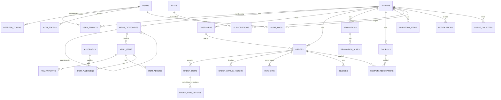

# Database Schema — V2 (PostgreSQL)

**Target schema for the V2 Restaurant SaaS Platform.** This document defines the fully normalized, multi-tenant PostgreSQL data model, the migration system, and the v1 → v2 data migration plan. It is the authoritative reference for the Sequelize models, the migration runner, and the seed/import services.

- Companion docs: [`01-codebase-audit.md`](./01-codebase-audit.md) · [`02-v2-roadmap.md`](./02-v2-roadmap.md)
- Status: **active.** The migration runner and migrations 001–005 are live in `backend/migrations/` (`npm run db:migrate`); a PostgreSQL 16 dev stack ships in `docker-compose.yml` (`db` service) and the backend selects its dialect via `DB_DIALECT`/`DATABASE_URL` (default stays SQLite). **The Sequelize models are aligned to the migration DDL** (`tableName` + `field` mappings), and migrations run at boot on both dialects — `sync()` is gone. The DDL below remains the authoritative PostgreSQL target — the scaffold migrations are its portable subset (known SQLite quirk documented in `migrations/001_identity_auth.js`).

---

## 1. Overview & Design Principles

| Principle | Decision | Reasoning |
|---|---|---|
| Multi-tenancy | **Shared database, row-level `tenant_id` scoping** | One migration path, pooled connections, cross-tenant admin analytics. Every business table carries `tenant_id NOT NULL`; composite indexes always lead with it. (See roadmap §2.) |
| Money | `DECIMAL(12,2)` stored; **no floats ever for money** | v1 stored money as `FLOAT` (rounding bugs). DECIMAL is exact; gateways payloads use integer *paisa* derived at the edge. |
| Identity | `BIGINT GENERATED ALWAYS AS IDENTITY` PKs; natural keys (slug, email) unique via **partial unique indexes** | Auto-increment keeps v1 ID continuity; UUIDs considered but rejected for now (chat with roadmap: BIGSERIAL keeps import mapping trivial). Public order numbers use `order_no` ULID-style string. |
| Timestamps | `timestamptz` everywhere (`created_at`, `updated_at` via trigger) | Correct across timezones; `updated_at` maintained by a shared trigger. |
| Soft delete | `deleted_at timestamptz NULL` on core tables + partial unique indexes | Archival without data loss; uniqueness only among live rows. |
| Audit | `audit_logs` append-only table (who/what/when/ip/metadata) + `created_by` columns on mutable tables | Non-repudiation for admin & auth events; row provenance for customer data. |
| Optimistic locking | `version int NOT NULL DEFAULT 1` on contended rows (menu items, orders) | Prevents lost updates in kitchen/merchant concurrent edits. |
| Enums | `TEXT` + `CHECK (… IN (…))` constraints, not PG `ENUM` | `ALTER TYPE … ADD VALUE` inside a transaction is painful; CHECKs are changeable with a migration. |
| Flexible data | `jsonb` for `settings`, `nutrition`, `metadata`, `options` | Schema-less by design where the shape varies per tenant. |
| Referential integrity | FK constraints with explicit `ON DELETE` policy; **no cascade deletes of tenant data** | Deletes are rare and deliberate (archival preferred); cascades risk mass data loss. |

---

## 2. Conventions

- **Naming:** `snake_case` tables (plural) and columns. FK columns: `<singular_table>_id`. Boolean flags: `is_*`. Money: `<name>_amount` (e.g. `unit_amount`, `total_amount`). 
- **Audit columns on mutable tables:** `created_at`, `updated_at`, `created_by` (nullable FK → `users.id`), `deleted_at` (nullable), `version` (int).
- **Tenant scoping:** every **tenant-owned business data table** (catalog, orders, customers, promotions, coupons, payments, inventory) has `tenant_id bigint NOT NULL REFERENCES tenants(id)`. Queries MUST filter by it; the repository layer defaults to a `tenant_id` predicate so a filter can never be forgotten (fail-closed). Join/lookup tables without a tenant (`item_allergens`, `allergens`, `payment_providers`, `favorites` — whose tenant is implied by the parent) are explicit exceptions.
- **Money columns:** `numeric(12,2)`. 12,2 ⇒ max `9,999,999,999.99` per value — ample for per-item and per-order amounts. Tax/discount columns follow the same rule.
- **Order status / state machines:** stored as `TEXT` + CHECK with allowed transitions enforced in the service layer (and mirrored in `order_status_history`).
- **Soft-deletable tables** (tagged `[soft]` in section 4): `tenants`, `users`, `menu_items`, `customers`, `coupons`, `promotions`.

---

## 3. ER Diagram

> Partial by design — shows the core entity graph; join tables (`item_allergens`, `coupon_redemptions`, `favorites`) and `notifications`/`payment_intents` are elided for readability.



---

## 4. Schema DDL

### 4.1 Identity & Authentication

```sql
-- Required extension (enable in every environment, incl. managed providers).
CREATE EXTENSION IF NOT EXISTS citext;

-- users: platform identity. Per-tenant roles live in user_tenants.
CREATE TABLE users (
    id                bigint GENERATED ALWAYS AS IDENTITY PRIMARY KEY,
    name              text        NOT NULL,
    email             citext      NOT NULL,           -- case-insensitive unique
    password_hash     text        NOT NULL,           -- bcrypt/argon2
    platform_role     text        NOT NULL DEFAULT 'member'
                      CHECK (platform_role IN ('platform_admin','member','customer')),
    email_verified_at timestamptz,
    two_factor_enabled boolean    NOT NULL DEFAULT false,
    two_factor_secret text,                           -- encrypted at rest (see §6)
    locale            text        NOT NULL DEFAULT 'en',
    created_at        timestamptz NOT NULL DEFAULT now(),
    updated_at        timestamptz NOT NULL DEFAULT now(),
    deleted_at        timestamptz,                    -- [soft]
    created_by        bigint REFERENCES users(id)
);

-- v1 stored `password`; renamed to password_hash during migration (see §9).
CREATE UNIQUE INDEX uq_users_email_active ON users (email) WHERE deleted_at IS NULL;
CREATE INDEX ix_users_platform_role ON users (platform_role) WHERE deleted_at IS NULL;

-- user_tenants: membership join — which users belong to which workspaces.
CREATE TABLE user_tenants (
    id         bigint GENERATED ALWAYS AS IDENTITY PRIMARY KEY,
    user_id    bigint NOT NULL REFERENCES users(id) ON DELETE CASCADE,
    tenant_id  bigint NOT NULL REFERENCES tenants(id) ON DELETE CASCADE,
    role       text   NOT NULL DEFAULT 'staff'
               CHECK (role IN ('owner','manager','cashier','kitchen','delivery','staff')),
    created_at timestamptz NOT NULL DEFAULT now(),
    UNIQUE (user_id, tenant_id)
);
CREATE INDEX ix_user_tenants_tenant ON user_tenants (tenant_id, role);

-- refresh_tokens: rotating sessions. Tokens stored as SHA-256 hashes.
CREATE TABLE refresh_tokens (
    id                   bigint GENERATED ALWAYS AS IDENTITY PRIMARY KEY,
    token_hash           char(64) NOT NULL UNIQUE,    -- sha256 hex of the raw token
    family_id            uuid     NOT NULL,           -- rotation family
    user_id              bigint   NOT NULL REFERENCES users(id) ON DELETE CASCADE,
    tenant_id            bigint   REFERENCES tenants(id),  -- session workspace
    expires_at           timestamptz NOT NULL,
    revoked_at           timestamptz,
    replaced_by_token_id bigint   REFERENCES refresh_tokens(id),
    created_by_ip        inet,
    user_agent           text,
    created_at           timestamptz NOT NULL DEFAULT now()
);
CREATE INDEX ix_refresh_tokens_family ON refresh_tokens (family_id);
CREATE INDEX ix_refresh_tokens_user   ON refresh_tokens (user_id) WHERE revoked_at IS NULL;
CREATE INDEX ix_refresh_tokens_expiry ON refresh_tokens (expires_at) WHERE revoked_at IS NULL;

-- auth_tokens: single-use email verification / password reset tokens (hashed).
CREATE TABLE auth_tokens (
    id         bigint GENERATED ALWAYS AS IDENTITY PRIMARY KEY,
    type       text NOT NULL CHECK (type IN ('email_verification','password_reset')),
    token_hash char(64) NOT NULL UNIQUE,
    user_id    bigint NOT NULL REFERENCES users(id) ON DELETE CASCADE,
    expires_at timestamptz NOT NULL,
    used_at    timestamptz,
    created_at timestamptz NOT NULL DEFAULT now()
);
CREATE INDEX ix_auth_tokens_user ON auth_tokens (user_id, type) WHERE used_at IS NULL;

-- login_attempts: brute-force protection ledger (rolled up hourly by a worker).
CREATE TABLE login_attempts (
    id         bigint GENERATED ALWAYS AS IDENTITY PRIMARY KEY,
    user_id    bigint REFERENCES users(id) ON DELETE CASCADE,
    identifier text NOT NULL,                         -- email attempted
    success    boolean NOT NULL DEFAULT false,
    ip         inet,
    user_agent text,
    created_at timestamptz NOT NULL DEFAULT now()
);
CREATE INDEX ix_login_attempts_idf_time ON login_attempts (identifier, created_at DESC);
```

### 4.2 Tenancy & SaaS

```sql
-- tenants: a tenant is a restaurant workspace.
-- NOTE: plans is created AFTER tenants in this file, so plan_id is a forward
-- FK. It ships as an ALTER in migration 002 (see §7) — never run this DDL
-- block before `plans` exists.
CREATE TABLE tenants (
    id         bigint GENERATED ALWAYS AS IDENTITY PRIMARY KEY,
    name       text NOT NULL,
    slug       text NOT NULL,                         -- public storefront slug
    logo_url   text,
    status     text NOT NULL DEFAULT 'active'
               CHECK (status IN ('active','trial','suspended','archived')),
    plan_id    bigint REFERENCES plans(id),           -- added in migration 002
    settings   jsonb NOT NULL DEFAULT '{}'::jsonb,    -- timezone, currency, features
    created_at timestamptz NOT NULL DEFAULT now(),
    updated_at timestamptz NOT NULL DEFAULT now(),
    deleted_at timestamptz,                           -- [soft]
    created_by bigint REFERENCES users(id)
);
CREATE UNIQUE INDEX uq_tenants_slug_active ON tenants (slug) WHERE deleted_at IS NULL;

-- plans: subscription catalog (SaaS).
CREATE TABLE plans (
    id         bigint GENERATED ALWAYS AS IDENTITY PRIMARY KEY,
    name       text NOT NULL,
    code       text NOT NULL UNIQUE,                  -- 'starter','grow','pro'
    price_mo   numeric(12,2) NOT NULL DEFAULT 0,
    is_active  boolean NOT NULL DEFAULT true,
    created_at timestamptz NOT NULL DEFAULT now()
);

-- subscriptions: a tenant's current subscription (period + cycle).
CREATE TABLE subscriptions (
    id            bigint GENERATED ALWAYS AS IDENTITY PRIMARY KEY,
    tenant_id     bigint NOT NULL REFERENCES tenants(id) ON DELETE CASCADE,
    plan_id       bigint NOT NULL REFERENCES plans(id),
    status        text NOT NULL DEFAULT 'trialing'
                  CHECK (status IN ('trialing','active','past_due','canceled','expired')),
    trial_ends_at timestamptz,
    current_period_start timestamptz NOT NULL,
    current_period_end   timestamptz NOT NULL,
    created_at    timestamptz NOT NULL DEFAULT now(),
    updated_at    timestamptz NOT NULL DEFAULT now()
);
CREATE INDEX ix_subscriptions_tenant ON subscriptions (tenant_id, status);
-- At most one non-terminal subscription per tenant (enforced at the app layer too).
CREATE UNIQUE INDEX uq_subscriptions_tenant_active ON subscriptions (tenant_id)
    WHERE status IN ('trialing','active','past_due');

-- feature_flags: per-plan/per-tenant capability toggles (no redeploy to flip).
CREATE TABLE feature_flags (
    id         bigint GENERATED ALWAYS AS IDENTITY PRIMARY KEY,
    name       text NOT NULL,
    plan_id    bigint REFERENCES plans(id),           -- NULL = global flag
    tenant_id  bigint REFERENCES tenants(id),         -- NULL = default
    enabled    boolean NOT NULL DEFAULT false,
    updated_at timestamptz NOT NULL DEFAULT now(),
    -- NULLS NOT DISTINCT (PG 15+) so NULL plan_id/tenant_id ("global"/"default")
    -- still participates in uniqueness.
    UNIQUE NULLS NOT DISTINCT (name, plan_id, tenant_id)
);

-- usage_counters: enforcement counters (orders this cycle, menu items, seats).
CREATE TABLE usage_counters (
    id         bigint GENERATED ALWAYS AS IDENTITY PRIMARY KEY,
    tenant_id  bigint NOT NULL REFERENCES tenants(id) ON DELETE CASCADE,
    metric     text NOT NULL,                         -- 'orders','menu_items','users'
    period_start date NOT NULL,
    value      bigint NOT NULL DEFAULT 0,
    UNIQUE (tenant_id, metric, period_start)
);
```

### 4.3 Menu & Catalog

```sql
-- menu_categories: hierarchical (self-referencing subcategories).
CREATE TABLE menu_categories (
    id         bigint GENERATED ALWAYS AS IDENTITY PRIMARY KEY,
    tenant_id  bigint NOT NULL REFERENCES tenants(id) ON DELETE CASCADE,
    parent_id  bigint REFERENCES menu_categories(id) ON DELETE SET NULL,
    name       text NOT NULL,
    sort_order integer NOT NULL DEFAULT 0,
    is_active  boolean NOT NULL DEFAULT true,
    created_at timestamptz NOT NULL DEFAULT now(),
    updated_at timestamptz NOT NULL DEFAULT now(),
    deleted_at timestamptz,                           -- [soft]
    created_by bigint REFERENCES users(id)
);
CREATE UNIQUE INDEX uq_menu_categories_tenant_name ON menu_categories (tenant_id, name)
    WHERE deleted_at IS NULL;
CREATE INDEX ix_menu_categories_tenant ON menu_categories (tenant_id, sort_order);

-- menu_items: the dish. [soft] [optimistic lock]
CREATE TABLE menu_items (
    id             bigint GENERATED ALWAYS AS IDENTITY PRIMARY KEY,
    tenant_id      bigint NOT NULL REFERENCES tenants(id) ON DELETE CASCADE,
    category_id    bigint REFERENCES menu_categories(id) ON DELETE SET NULL,
    name           text NOT NULL,
    description    text,
    image_url      text,                              -- CDN object key
    base_price     numeric(12,2) NOT NULL CHECK (base_price >= 0),
    prep_minutes   smallint CHECK (prep_minutes > 0),
    nutrition      jsonb NOT NULL DEFAULT '{}'::jsonb, -- kcal, protein, carbs, fat
    ingredients    jsonb NOT NULL DEFAULT '[]'::jsonb, -- display list
    is_available   boolean NOT NULL DEFAULT true,
    availability   jsonb NOT NULL DEFAULT '{}'::jsonb, -- per-day windows
    version        integer NOT NULL DEFAULT 1,         -- optimistic lock
    created_at     timestamptz NOT NULL DEFAULT now(),
    updated_at     timestamptz NOT NULL DEFAULT now(),
    deleted_at     timestamptz,                        -- [soft]
    created_by     bigint REFERENCES users(id)
);
CREATE INDEX ix_menu_items_tenant_cat ON menu_items (tenant_id, category_id)
    WHERE deleted_at IS NULL;
CREATE INDEX ix_menu_items_available ON menu_items (tenant_id) 
    WHERE is_available AND deleted_at IS NULL;

-- item_variants: multiple sizes/prices per item ("Regular 250gm", "Large 400gm").
CREATE TABLE item_variants (
    id          bigint GENERATED ALWAYS AS IDENTITY PRIMARY KEY,
    tenant_id   bigint NOT NULL REFERENCES tenants(id) ON DELETE CASCADE,
    menu_item_id bigint NOT NULL REFERENCES menu_items(id) ON DELETE CASCADE,
    name        text NOT NULL,                        -- size/type label
    price_adjustment numeric(12,2) NOT NULL DEFAULT 0 CHECK (price_adjustment >= 0),
    is_default  boolean NOT NULL DEFAULT false,
    sort_order  integer NOT NULL DEFAULT 0,
    created_at  timestamptz NOT NULL DEFAULT now()
);
CREATE INDEX ix_item_variants_item ON item_variants (menu_item_id);

-- item_addons: option groups + choices ("Extra cheese", "Add jalapeño").
CREATE TABLE item_addons (
    id           bigint GENERATED ALWAYS AS IDENTITY PRIMARY KEY,
    tenant_id    bigint NOT NULL REFERENCES tenants(id) ON DELETE CASCADE,
    menu_item_id bigint NOT NULL REFERENCES menu_items(id) ON DELETE CASCADE,
    group_name   text NOT NULL,                       -- "Toppings"
    option_name  text NOT NULL,                       -- "Extra cheese"
    price        numeric(12,2) NOT NULL DEFAULT 0,
    max_qty      smallint NOT NULL DEFAULT 1,
    sort_order   integer NOT NULL DEFAULT 0,
    created_at   timestamptz NOT NULL DEFAULT now()
);
CREATE INDEX ix_item_addons_item ON item_addons (menu_item_id);

-- allergens: shared catalog; item_allergens is the m:n join.
CREATE TABLE allergens (
    id        bigint GENERATED ALWAYS AS IDENTITY PRIMARY KEY,
    code      text NOT NULL UNIQUE,                   -- 'gluten','dairy','nuts',…
    label     text NOT NULL
);
CREATE TABLE item_allergens (
    menu_item_id bigint NOT NULL REFERENCES menu_items(id) ON DELETE CASCADE,
    allergen_id  bigint NOT NULL REFERENCES allergens(id) ON DELETE CASCADE,
    PRIMARY KEY (menu_item_id, allergen_id)
);

-- inventory_items: stock overview per menu item (Phase 3+).
CREATE TABLE inventory_items (
    id           bigint GENERATED ALWAYS AS IDENTITY PRIMARY KEY,
    tenant_id    bigint NOT NULL REFERENCES tenants(id) ON DELETE CASCADE,
    menu_item_id bigint REFERENCES menu_items(id) ON DELETE SET NULL,
    name         text NOT NULL,
    stock_qty    numeric(10,2) NOT NULL DEFAULT 0,
    low_stock_at numeric(10,2) NOT NULL DEFAULT 0,
    unit         text NOT NULL DEFAULT 'pcs',
    updated_at   timestamptz NOT NULL DEFAULT now(),
    UNIQUE (tenant_id, menu_item_id)
);

-- availability_overrides: per-day windows that override an item's repeating
-- availability schedule (menu_items.available_from / available_to) for a
-- single calendar date (migration 022, Phase 4 follow-up).
-- Both bounds NULL = explicitly closed all day; otherwise the 'HH:MM' bounds
-- follow the base-window rules (one-sided + overnight included). Enforced on
-- the storefront (hidden outside the effective window) and at checkout
-- (AVAILABILITY_WINDOW) — scheduled orders validate against the scheduled
-- date's override. One override per (tenant, item, date).
CREATE TABLE availability_overrides (
    id             bigint GENERATED ALWAYS AS IDENTITY PRIMARY KEY,
    tenant_id      bigint NOT NULL REFERENCES tenants(id) ON DELETE CASCADE,
    menu_item_id   bigint NOT NULL REFERENCES menu_items(id) ON DELETE CASCADE,
    date           date NOT NULL,
    available_from text,                              -- 'HH:MM' (NULL = from midnight)
    available_to   text,                              -- 'HH:MM' (NULL = until midnight)
    created_at     timestamptz NOT NULL DEFAULT now(),
    updated_at     timestamptz NOT NULL DEFAULT now(),
    UNIQUE (tenant_id, menu_item_id, date)
);
CREATE INDEX ix_availability_overrides_tenant_date ON availability_overrides (tenant_id, date);

-- tenant_closure_dates: restaurant-wide closure days (migration 023,
-- Phase 4/5 follow-up). One row per tenant + date closes the WHOLE
-- storefront that day (holidays, private events): the public menu is
-- hidden and checkout is rejected (AVAILABILITY_WINDOW); scheduled orders
-- are validated against the scheduled date, so a closure blocks scheduled
-- orders for that day too.
CREATE TABLE tenant_closure_dates (
    id           bigint GENERATED ALWAYS AS IDENTITY PRIMARY KEY,
    tenant_id    bigint NOT NULL REFERENCES tenants(id) ON DELETE CASCADE,
    date         date NOT NULL,
    created_at   timestamptz NOT NULL DEFAULT now(),
    updated_at   timestamptz NOT NULL DEFAULT now(),
    UNIQUE (tenant_id, date)
);

-- availability_weekday_rules: recurring availability patterns (migration
-- 023). A row with menu_item_id NULL = restaurant-wide weekday closure
-- ("closed every Saturday" — both bounds NULL, enforced by the API); a row
-- with menu_item_id set = a per-item rule that REPLACES the base window for
-- that weekday (weekend hours, "closed Mondays" — both bounds NULL).
-- Resolution order at a given date/time (storefront + checkout):
--   tenant closure date → per-item weekday rule → per-day override → base
--   window.
CREATE TABLE availability_weekday_rules (
    id             bigint GENERATED ALWAYS AS IDENTITY PRIMARY KEY,
    tenant_id      bigint NOT NULL REFERENCES tenants(id) ON DELETE CASCADE,
    menu_item_id   bigint REFERENCES menu_items(id) ON DELETE CASCADE, -- NULL = restaurant-wide
    weekday        integer NOT NULL,                     -- 0=Sun … 6=Sat (JS getDay)
    available_from text,                                  -- 'HH:MM' (NULL = closed/from midnight)
    available_to   text,                                  -- 'HH:MM' (NULL = closed/until midnight)
    created_at     timestamptz NOT NULL DEFAULT now(),
    updated_at     timestamptz NOT NULL DEFAULT now()
);
-- One per-item rule per weekday; one restaurant-wide rule per weekday.
CREATE UNIQUE INDEX uq_weekday_rule_item   ON availability_weekday_rules (tenant_id, menu_item_id, weekday) WHERE menu_item_id IS NOT NULL;
CREATE UNIQUE INDEX uq_weekday_rule_tenant ON availability_weekday_rules (tenant_id, weekday) WHERE menu_item_id IS NULL;
CREATE INDEX ix_weekday_rules_tenant_weekday ON availability_weekday_rules (tenant_id, weekday);
```

### 4.4 Customers

```sql
-- customers: guest checkout or registered users (customer platform role).
CREATE TABLE customers (
    id         bigint GENERATED ALWAYS AS IDENTITY PRIMARY KEY,
    tenant_id  bigint NOT NULL REFERENCES tenants(id) ON DELETE CASCADE,
    user_id    bigint REFERENCES users(id) ON DELETE SET NULL, -- when registered
    name       text NOT NULL,
    phone      text NOT NULL,
    email      citext,
    total_orders integer NOT NULL DEFAULT 0,           -- denormalized counter
    created_at timestamptz NOT NULL DEFAULT now(),
    updated_at timestamptz NOT NULL DEFAULT now(),
    deleted_at timestamptz                            -- [soft]
);
CREATE UNIQUE INDEX uq_customers_tenant_phone ON customers (tenant_id, phone)
    WHERE deleted_at IS NULL;

-- favorites: registered customers' saved items/restaurants.
CREATE TABLE favorites (
    id           bigint GENERATED ALWAYS AS IDENTITY PRIMARY KEY,
    customer_id  bigint NOT NULL REFERENCES customers(id) ON DELETE CASCADE,
    menu_item_id bigint REFERENCES menu_items(id) ON DELETE CASCADE,
    created_at   timestamptz NOT NULL DEFAULT now(),
    UNIQUE (customer_id, menu_item_id)
);

-- reviews: ratings + comments per order item / dish.
CREATE TABLE reviews (
    id           bigint GENERATED ALWAYS AS IDENTITY PRIMARY KEY,
    tenant_id    bigint NOT NULL REFERENCES tenants(id) ON DELETE CASCADE,
    customer_id  bigint NOT NULL REFERENCES customers(id) ON DELETE CASCADE,
    menu_item_id bigint REFERENCES menu_items(id) ON DELETE SET NULL,
    order_id     bigint REFERENCES orders(id) ON DELETE SET NULL,
    rating       smallint NOT NULL CHECK (rating BETWEEN 1 AND 5),
    comment      text,
    created_at   timestamptz NOT NULL DEFAULT now(),
    UNIQUE (customer_id, menu_item_id, order_id)
);
```

### 4.5 Orders & Fulfillment

```sql
-- orders: the core business document. [optimistic lock on status updates]
CREATE TABLE orders (
    id               bigint GENERATED ALWAYS AS IDENTITY PRIMARY KEY,
    tenant_id        bigint NOT NULL REFERENCES tenants(id) ON DELETE CASCADE,
    customer_id      bigint REFERENCES customers(id) ON DELETE SET NULL,
    order_no         text NOT NULL,                    -- human-facing, ULID-style
    status           text NOT NULL DEFAULT 'placed'
                     CHECK (status IN ('placed','confirmed','preparing','ready',
                                       'out_for_delivery','delivered','cancelled','rejected')),
    type             text NOT NULL CHECK (type IN ('pickup','delivery','scheduled')),
    scheduled_for    timestamptz,                      -- when type = scheduled
    delivery_address text,
    delivery_lat     numeric(10,7),
    delivery_lng     numeric(10,7),
    delivery_fee     numeric(12,2) NOT NULL DEFAULT 0,
    subtotal_amount  numeric(12,2) NOT NULL CHECK (subtotal_amount >= 0),
    discount_amount  numeric(12,2) NOT NULL DEFAULT 0,
    tax_amount       numeric(12,2) NOT NULL DEFAULT 0,
    total_amount     numeric(12,2) NOT NULL CHECK (total_amount >= 0),
    currency         char(3) NOT NULL DEFAULT 'BDT',
    payment_status   text NOT NULL DEFAULT 'unpaid'
                     CHECK (payment_status IN ('unpaid','pending','paid','refunded','failed')),
    notes            text,
    assigned_to      bigint REFERENCES users(id),      -- delivery staff
    created_at       timestamptz NOT NULL DEFAULT now(),
    updated_at       timestamptz NOT NULL DEFAULT now(),
    deleted_at       timestamptz,                      -- [soft]
    created_by       bigint REFERENCES users(id)       -- cashier who created it
);
CREATE INDEX ix_orders_tenant_created ON orders (tenant_id, created_at DESC);
CREATE INDEX ix_orders_tenant_status  ON orders (tenant_id, status) 
    WHERE deleted_at IS NULL AND status NOT IN ('delivered','cancelled','rejected');
CREATE INDEX ix_orders_tenant_customer ON orders (tenant_id, customer_id);
CREATE UNIQUE INDEX uq_orders_tenant_no ON orders (tenant_id, order_no);

-- order_items: line snapshot (price frozen at order time, never FK-joined for totals).
CREATE TABLE order_items (
    id           bigint GENERATED ALWAYS AS IDENTITY PRIMARY KEY,
    tenant_id    bigint NOT NULL REFERENCES tenants(id) ON DELETE CASCADE,
    order_id     bigint NOT NULL REFERENCES orders(id) ON DELETE CASCADE,
    menu_item_id bigint REFERENCES menu_items(id) ON DELETE SET NULL,
    item_name    text NOT NULL,                        -- snapshot
    quantity     smallint NOT NULL CHECK (quantity > 0),
    unit_amount  numeric(12,2) NOT NULL CHECK (unit_amount >= 0),
    discount_amount numeric(12,2) NOT NULL DEFAULT 0,
    line_amount  numeric(12,2) NOT NULL CHECK (line_amount >= 0),
    version      integer NOT NULL DEFAULT 1            -- optimistic lock
);
CREATE INDEX ix_order_items_order ON order_items (order_id);

-- order_item_options: variant/add-on choices selected for a line.
CREATE TABLE order_item_options (
    id           bigint GENERATED ALWAYS AS IDENTITY PRIMARY KEY,
    order_item_id bigint NOT NULL REFERENCES order_items(id) ON DELETE CASCADE,
    group_name   text NOT NULL,                        -- snapshot
    option_name  text NOT NULL,                        -- snapshot
    price        numeric(12,2) NOT NULL DEFAULT 0,
    created_at   timestamptz NOT NULL DEFAULT now()
);
CREATE INDEX ix_order_item_options_line ON order_item_options (order_item_id);

-- order_status_history: immutable timeline of every status change.
CREATE TABLE order_status_history (
    id         bigint GENERATED ALWAYS AS IDENTITY PRIMARY KEY,
    order_id   bigint NOT NULL REFERENCES orders(id) ON DELETE CASCADE,
    from_status text,
    to_status  text NOT NULL,
    changed_by bigint REFERENCES users(id),
    reason     text,
    created_at timestamptz NOT NULL DEFAULT now()
);
CREATE INDEX ix_order_status_history_order ON order_status_history (order_id, created_at);

-- invoices: one per order, PDF reference.
CREATE TABLE invoices (
    id             bigint GENERATED ALWAYS AS IDENTITY PRIMARY KEY,
    tenant_id      bigint NOT NULL REFERENCES tenants(id) ON DELETE CASCADE,
    order_id       bigint NOT NULL UNIQUE REFERENCES orders(id) ON DELETE CASCADE,
    invoice_no     text NOT NULL UNIQUE,
    pdf_url        text,
    issued_at      timestamptz NOT NULL DEFAULT now()
);
```

### 4.6 Promotions & Coupons

```sql
-- promotions: percentage / fixed / weighted (v1 slab engine preserved & scoped).
CREATE TABLE promotions (
    id              bigint GENERATED ALWAYS AS IDENTITY PRIMARY KEY,
    tenant_id       bigint NOT NULL REFERENCES tenants(id) ON DELETE CASCADE,
    title           text NOT NULL,
    type            text NOT NULL
                    CHECK (type IN ('percentage','fixed','weighted')),
    percentage_value numeric(12,2) CHECK (percentage_value BETWEEN 0 AND 100),
    fixed_value     numeric(12,2) CHECK (fixed_value >= 0),
    start_date      date NOT NULL,
    end_date        date NOT NULL CHECK (end_date >= start_date),
    is_enabled      boolean NOT NULL DEFAULT true,
    max_discount    numeric(12,2),                     -- cap
    created_at      timestamptz NOT NULL DEFAULT now(),
    updated_at      timestamptz NOT NULL DEFAULT now(),
    deleted_at      timestamptz,                       -- [soft]
    created_by      bigint REFERENCES users(id)
);
CREATE INDEX ix_promotions_tenant_dates ON promotions (tenant_id, start_date, end_date);

-- promotion_slabs: weighted discounts by weight band (v1 engine).
CREATE TABLE promotion_slabs (
    id                   bigint GENERATED ALWAYS AS IDENTITY PRIMARY KEY,
    promotion_id         bigint NOT NULL REFERENCES promotions(id) ON DELETE CASCADE,
    min_weight_gm        integer NOT NULL CHECK (min_weight_gm >= 0),
    max_weight_gm        integer NOT NULL CHECK (max_weight_gm > min_weight_gm),
    discount_per_500gm   numeric(12,2) NOT NULL CHECK (discount_per_500gm >= 0)
);
CREATE INDEX ix_promotion_slabs_promo ON promotion_slabs (promotion_id);

-- coupons: customer-facing codes.
CREATE TABLE coupons (
    id           bigint GENERATED ALWAYS AS IDENTITY PRIMARY KEY,
    tenant_id    bigint NOT NULL REFERENCES tenants(id) ON DELETE CASCADE,
    code         text NOT NULL,
    kind         text NOT NULL CHECK (kind IN ('percent','fixed')),
    value        numeric(12,2) NOT NULL,
    min_order_amount numeric(12,2),
    max_redemptions integer,
    starts_at    timestamptz,
    expires_at   timestamptz,
    is_active    boolean NOT NULL DEFAULT true,
    created_at   timestamptz NOT NULL DEFAULT now(),
    deleted_at   timestamptz                          -- [soft]
);
CREATE UNIQUE INDEX uq_coupons_tenant_code ON coupons (tenant_id, code)
    WHERE deleted_at IS NULL;

-- coupon_redemptions: audit of every coupon use (anti-abuse).
CREATE TABLE coupon_redemptions (
    id          bigint GENERATED ALWAYS AS IDENTITY PRIMARY KEY,
    tenant_id   bigint NOT NULL REFERENCES tenants(id) ON DELETE CASCADE,
    coupon_id   bigint NOT NULL REFERENCES coupons(id) ON DELETE CASCADE,
    order_id    bigint NOT NULL REFERENCES orders(id) ON DELETE CASCADE,
    amount_off  numeric(12,2) NOT NULL,
    created_at  timestamptz NOT NULL DEFAULT now(),
    UNIQUE (coupon_id, order_id)
);
```

### 4.7 Payments

```sql
-- payment_providers: registry of enabled gateways per tenant.
CREATE TABLE payment_providers (
    id        bigint GENERATED ALWAYS AS IDENTITY PRIMARY KEY,
    code      text NOT NULL UNIQUE,                    -- 'sslcommerz','bkash','nagad','rocket','stripe'
    name      text NOT NULL,
    is_active boolean NOT NULL DEFAULT true
);

-- payments: one-or-many per order (split payments, refunds).
-- Refunds are NEW positive-amount rows with status 'refunded'/'partial_refunded'
-- pointing at the original payment via parent_payment_id (amount > 0 always;
-- a refund never has a negative amount).
CREATE TABLE payments (
    id                 bigint GENERATED ALWAYS AS IDENTITY PRIMARY KEY,
    tenant_id          bigint NOT NULL REFERENCES tenants(id) ON DELETE CASCADE,
    order_id           bigint NOT NULL REFERENCES orders(id) ON DELETE CASCADE,
    provider_id        bigint NOT NULL REFERENCES payment_providers(id),
    parent_payment_id  bigint REFERENCES payments(id), -- refund rows reference the original
    status             text NOT NULL DEFAULT 'pending'
                    CHECK (status IN ('pending','authorized','captured','failed','refunded','partial_refunded')),
    amount             numeric(12,2) NOT NULL CHECK (amount > 0),
    currency           char(3) NOT NULL DEFAULT 'BDT',
    gateway_txn_ref    text,                            -- provider transaction id
    failure_reason     text,
    created_at         timestamptz NOT NULL DEFAULT now(),
    updated_at         timestamptz NOT NULL DEFAULT now()
);
CREATE INDEX ix_payments_order ON payments (order_id);
CREATE UNIQUE INDEX uq_payments_gateway_ref ON payments (gateway_txn_ref) 
    WHERE gateway_txn_ref IS NOT NULL;

-- payment_intents: idempotency record for initiating payments.
CREATE TABLE payment_intents (
    id              bigint GENERATED ALWAYS AS IDENTITY PRIMARY KEY,
    tenant_id       bigint NOT NULL REFERENCES tenants(id) ON DELETE CASCADE,
    order_id        bigint NOT NULL REFERENCES orders(id) ON DELETE CASCADE,
    provider_id     bigint NOT NULL REFERENCES payment_providers(id),
    idempotency_key uuid NOT NULL UNIQUE,
    amount          numeric(12,2) NOT NULL,
    status          text NOT NULL DEFAULT 'created'
                    CHECK (status IN ('created','redirected','succeeded','failed','expired')),
    created_at      timestamptz NOT NULL DEFAULT now(),
    updated_at      timestamptz NOT NULL DEFAULT now()
);
CREATE INDEX ix_payment_intents_order ON payment_intents (order_id, status);
```

### 4.8 Ops, Audit & Notifications

```sql
-- audit_logs: append-only. Inserts only (no UPDATE/DELETE by application).
CREATE TABLE audit_logs (
    id          bigint GENERATED ALWAYS AS IDENTITY PRIMARY KEY,
    actor_id    bigint REFERENCES users(id) ON DELETE SET NULL,
    tenant_id   bigint REFERENCES tenants(id) ON DELETE SET NULL,
    action      text NOT NULL,                          -- 'auth.login', 'order.status', …
    entity_type text,
    entity_id   text,
    metadata    jsonb NOT NULL DEFAULT '{}'::jsonb,
    ip          inet,
    created_at  timestamptz NOT NULL DEFAULT now()
);
CREATE INDEX ix_audit_logs_tenant_time ON audit_logs (tenant_id, created_at DESC);
CREATE INDEX ix_audit_logs_actor_time  ON audit_logs (actor_id, created_at DESC);
CREATE INDEX ix_audit_logs_action      ON audit_logs (action, created_at DESC);

-- notifications: in-app + outbound queue rows (email/SMS/push fan-out later).
CREATE TABLE notifications (
    id          bigint GENERATED ALWAYS AS IDENTITY PRIMARY KEY,
    tenant_id   bigint REFERENCES tenants(id) ON DELETE CASCADE,
    user_id     bigint REFERENCES users(id) ON DELETE CASCADE,
    type        text NOT NULL,                          -- 'order.status','promo','system'
    channel     text NOT NULL DEFAULT 'in_app'
                CHECK (channel IN ('in_app','email','sms','push')),
    title       text NOT NULL,
    body        text,
    payload     jsonb NOT NULL DEFAULT '{}'::jsonb,
    read_at     timestamptz,
    created_at  timestamptz NOT NULL DEFAULT now()
);
CREATE INDEX ix_notifications_user ON notifications (user_id, read_at, created_at DESC);

-- schema_migrations: bookkeeping for the migration runner (see §8).
CREATE TABLE schema_migrations (
    name       text PRIMARY KEY,
    applied_at timestamptz NOT NULL DEFAULT now()
);
```

---

## 5. Index Strategy

Beyond the per-table indexes above, the following rules apply:

| Pattern | Index | Example |
|---|---|---|
| Tenant isolation | Composite index **leading with `tenant_id`** on every business table | `ix_orders_tenant_created (tenant_id, created_at DESC)` |
| List filtering | Tenant + status/date columns | `ix_orders_tenant_status`, `ix_promotions_tenant_dates` |
| Unique on soft-deletable | **Partial unique index** `WHERE deleted_at IS NULL` | `uq_tenants_slug_active`, `uq_users_email_active` |
| Order timeline | `(order_id, created_at)` for status history | `ix_order_status_history_order` |
| Session lookup | `refresh_tokens (family_id)`; `(user_id) WHERE revoked_at IS NULL` | rotation + reuse checks stay O(log n) |
| Time-series trimming | `audit_logs`, `login_attempts` get a **retention worker** (e.g. 90 days, partitioned or batch-deleted) | prevents unbounded growth |
| Full-text search (Phase 4) | GIN on `to_tsvector('simple', name)` for menu + `pg_trgm` on names | storefront search |
| JSONB access | GIN on `settings`, `nutrition` only when queried | avoid indexing hot `jsonb` prematurely |

**Explain/verify:** every new query must be checked with `EXPLAIN (ANALYZE, BUFFERS)` against a seeded dataset before merge (Phase 9 gates on p95 targets).

---

## 6. Constraints, Soft Delete & Audit

### Constraints
- **NOT NULL** on every `tenant_id`, money column, and FK that is logically required.
- **CHECK** for enum-like values, non-negative money, `end_date >= start_date`, `rating BETWEEN 1 AND 5`, `quantity > 0`, price caps.
- **Unique** partial indexes for natural keys on soft-deletable tables; plain `UNIQUE` elsewhere.
- **Composite FKs** are avoided; each FK is a single column so partial indexes can reference them.

### Soft delete policy
- Core soft-deletable tables: `tenants`, `users`, `menu_categories`, `menu_items`, `customers`, `promotions`, `coupons`, `orders`.
- Deletion = `deleted_at = now()`; **application queries never include soft-deleted rows** (repository default `where deleted_at IS NULL`).
- Physical purge is a scheduled, batched, logged job (with backup) — never triggered by users.
- Archiving a tenant flips `tenants.status = 'archived'` and, via the scoping middleware, rejects new writes while keeping read access for regulatory/audit purposes.

### Audit fields
- `created_at` / `updated_at` on all mutable tables; `updated_at` maintained by the shared trigger below.
- `created_by` on tenant-scoped mutable tables (provenance).
- `audit_logs` for **events** (auth, admin actions, order status changes, coupon redemptions). Rows are insert-only; a DB user with `INSERT`-only privileges on this table can enforce append-only.

```sql
-- Shared updated_at trigger (applied to every table with an updated_at column).
CREATE OR REPLACE FUNCTION set_updated_at() RETURNS trigger AS $$
BEGIN
    NEW.updated_at = now();
    RETURN NEW;
END $$ LANGUAGE plpgsql;

-- Example:
CREATE TRIGGER trg_users_updated_at BEFORE UPDATE ON users
    FOR EACH ROW EXECUTE FUNCTION set_updated_at();
```

### Sensitive data
- `users.password_hash`, `refresh_tokens.token_hash`, `auth_tokens.token_hash` — **hashed**, never raw.
- `users.two_factor_secret` — encrypted at rest (app-level envelope encryption; key in the secrets manager, never in the repo).

---

## 7. Migrations

### Runner
- Node-based runner, `backend/scripts/migrate.js` — npm scripts:
  - `npm run db:migrate` — apply all pending migrations (`up`).
  - `npm run db:migrate:down` — roll back the most recent migration (`down --name <migration>` for a specific one; only the most recent may be rolled back).
  - `npm run db:migrate:status` — list applied / pending.
- Reads `backend/migrations/*.js` (versioned, sequential). Applies each inside a transaction, recording `name` in `schema_migrations` (re-runs are no-ops; completion is recorded only after a successful `up`).
- **Boot behavior:** the app runs pending migrations automatically at startup (`src/index.js`) on **both** dialects — the models are aligned to the migration DDL (`tableName`/`field`), so `sync()` and the old `ensureSchemaColumns` bridge are removed. Migrating an existing dev SQLite DB: back up → delete → `db:migrate` → re-seed (or `db:migrate:v1 --source` to preserve old data).

### Migration file contract

```js
export const up = async (qi, transaction) => {
  await qi.createTable('menu_items', { /* … */ }, { transaction });
};
export const down = async (qi, transaction) => {
  await qi.dropTable('menu_items', { transaction });
};
```

### Timeline of expected migrations

| # | Migration | Phase | Status |
|---|---|---|---|
| 001 | `users`, `user_tenants`, `refresh_tokens`, `auth_tokens`, `login_attempts`, `audit_logs`, `tenants` (without `plan_id`) | 2 | ✅ shipped (scaffold) |
| 002 | `plans`, `subscriptions`, `feature_flags`, `usage_counters`; **`ALTER tenants ADD plan_id` FK** | 3 | ✅ shipped (scaffold) |
| 003 | `menu_categories`, `menu_items`, `item_variants`, `item_addons`, `allergens`, `item_allergens`, `inventory_items` | 4 | ✅ shipped (scaffold) |
| 004 | `orders`, `order_items`, `promotions`, `promotion_slabs` | 5/6 | ✅ shipped early — the v1→v2 data migration needs these target tables |
| 005 | **v1 field bridge** — `menu_items.weight_gm`, `orders.customer_name/phone/address`, `order_items.weight_per_unit_gm/total_weight_gm` (columns the aligned models need) | 4 | ✅ shipped |
| 006 | `customers`, `favorites` | 4/5 |
| 007 | `order_item_options`, `order_status_history`, `invoices`, `reviews` | 5 |
| 007b | `reviews` FK to `orders` (drop + re-add if orders shipped first) | 5 |
| 008 | `coupons`, `coupon_redemptions` | 3/6 |
| 009 | `payment_providers`, `payments`, `payment_intents` | 6 |
| 010 | `notifications`, retention jobs | 5/8 |
| 021 | `item_variants.low_stock_at` (variant-level low-stock alert threshold) | 4 | ✅ shipped |
| 022 | `availability_overrides` (per-day availability override per item) | 4 | ✅ shipped |
| 023 | `tenant_closure_dates` + `availability_weekday_rules` (restaurant-wide closure days, recurring weekday rules) | 4/5 | ✅ shipped |
| 024 | `tenant_closure_dates.label` (optional holiday names) | 4/5 | ✅ shipped |
| 025 | `orders.cancel_reason/canceled_by/delivery_zone/prep_started_at/bumped_at`, `user_tenants.delivery_zones`, `delivery_zones`, `order_edit_requests` (order editing approval flow, delivery auto-assign, KDS bump/prep/overdue, cancellation reasons) | 5 | ✅ shipped |

---

## 8. v1 → v2 Data Migration Plan

**Goal:** move every v1 record (SQLite: `products`, `promotions`, `promotion_slabs`, `orders`, `order_items`, `users`) into PostgreSQL under a default tenant, with no data loss, then verify.

> **Implemented:** `npm run db:migrate:v1 -- --source <v1.sqlite>` runs this plan against the configured target (PG for the real cutover, SQLite for dry-runs/tests — all DML is portable). It preserves IDs 1:1 (id maps implicit), rounds all money to 2dp, fixes PG sequences, and blocks on the verification queries in §8.3. Covered by `src/__tests__/v1toV2.test.js`.

### 8.1 Preconditions
1. Freeze writes: maintenance window; stop the API (`docker compose down api`) or set read-only.
2. `pg_dump` a baseline of the target PG (empty or pre-seeded).
3. Snapshot the SQLite file (copy `backend/data.sqlite`) as the rollback point.
4. Dry-run against a copy first; only then run for real.

### 8.2 Mapping

| v1 (SQLite) | v2 (PostgreSQL) | Transformation |
|---|---|---|
| `users` | `users` + `user_tenants` | Create default tenant first; `password` → `password_hash` (no rehash); **only the seeded admin** gets `platform_role='platform_admin'` + `user_tenants(role='owner')`; all other legacy users get `platform_role='member'` and no tenant membership (they hold no restaurant rights) |
| `products` | `menu_items` | `tenant_id = default`; `price` float → `round(price::numeric, 2)`; `enabled` → `is_available`; auto-create a `menu_categories` "General" bucket |
| `promotions` | `promotions` | `tenant_id = default`; floats → DECIMAL; `enabled` → `is_enabled` |
| `promotion_slabs` | `promotion_slabs` | Keep `promotion_id` mapping (remap via id-map); floats → DECIMAL |
| `orders` | `orders` | `tenant_id = default`; `grand_total` → `total_amount`; `subtotal` → `subtotal_amount`; `total_discount` → `discount_amount`; floats → DECIMAL; `status = 'placed'`; **`payment_status = 'unpaid'`** — v1 had no payment concept, so nothing can be considered paid |
| `order_items` | `order_items` | `unit_price` → `unit_amount`, `line_total` → `line_amount`; floats → DECIMAL; `product_id` → `menu_item_id` (nullable, remapped) |

### 8.3 Procedure
1. **Create default tenant** (slug `default` / name "Your Restaurant") — the roadmap's home for all v1 data.
2. **ID remap tables** in the migration transaction: `INSERT INTO _mig_users (old_id, new_id)` etc., so FKs stay correct.
3. **Bulk copy with `COPY`** (or batched `INSERT … ON CONFLICT DO NOTHING`) for each table in dependency order: `users` → `tenants` → `user_tenants` → `menu_categories` → `menu_items` → `promotions` → `promotion_slabs` → `orders` → `order_items` → `order_status_history` (seed a `placed` entry per order) → `invoices` (regenerate).
4. **Sequence fix:** `SELECT setval(pg_get_serial_sequence('orders','id'), (SELECT max(id) FROM orders))` per table so new inserts never collide with migrated IDs.
5. **Verify (blocking queries):**
   - Row counts match per table (`SELECT count(*)` both sides).
   - Money invariant: `SUM(order_items.line_amount) == orders.total_amount - tax - delivery_fee` for a sample.
   - **Discount reconciliation:** `SUM(order_items.discount_amount) == orders.discount_amount` (catches promotion-engine mapping bugs — v1 stored per-item `OrderItem.discount` vs `Order.total_discount`).
   - FK integrity: `SELECT count(*) FROM order_items oi LEFT JOIN orders o ON oi.order_id=o.id WHERE o.id IS NULL` must be 0.
   - Spot-check top-10 customers' order history.
6. **Cutover:** point `DB_STORAGE`/`DATABASE_URL` to PG, run `npm run db:migrate`, boot API, run the e2e smoke suite against PG.
7. **Rollback:** restore SQLite snapshot + stop PG writes; the API is config-driven so the flip-back is one env change. Keep the SQLite file archived (read-only) for 90 days.

### 8.4 Money handling (critical)
- v1 floats were already rounded to 2 dp by the app, but **defensive rounding** applies: `ROUND(price::numeric, 2)`.
- Grand totals recomputed server-side after import (never trusted from source): `subtotal - discount + tax + delivery` re-derived and any drift logged, not silently accepted.
- All subsequent money math in the platform is DECIMAL; gateways serialize to integer *paisa* at the adapter boundary.

---

## 9. Schema Rollout by Phase

| Phase | Tables added | Notes |
|---|---|---|
| 1 (done) | (SQLite) legacy tables + hardening; **PG stack follow-up: migration runner, migrations 001–005, `pg` driver, dialect-selectable config, PostgreSQL 16 dev service, models aligned to the migration DDL, PG-in-CI tier, cutover runbook** | Money still FLOAT at the model level (columns are DECIMAL in the migration DDL); PG schema managed by migrations only |
| 2 (done) | `users`+columns, `user_tenants`, `tenants`, `refresh_tokens`, `auth_tokens`, `audit_logs` (SQLite forms of 001) | Column adds via `schemaSync`; full DDL above is the PG target |
| 3 | `plans`, `subscriptions`, `feature_flags`, `usage_counters`; harden tenant scoping | PG switch + migration 001–002 land here |
| 4 | `menu_categories`, `menu_items`, `item_variants`, `item_addons`, `allergens`, `item_allergens`, `inventory_items` | migration 003 |
| 5 | `customers`, `favorites`, `orders`, `order_items`, `order_item_options`, `order_status_history`, `reviews`, `invoices`, `notifications` | migrations 004–005, 008 |
| 6 | `payments`, `payment_intents`, `payment_providers`; coupons | migrations 006–007 |
| 7–8 | `reports_cache`/materialized rollups; retention workers | analytics + ops |
| 9 | Partitioning/archive of `audit_logs`, `order_status_history` if volume demands | perf hardening |

---

## 10. Open Decisions

- **`citext` extension** — **committed** (see §4.1); enable in all environments, including managed providers that require the extension pre-created.
- **UUIDs for public entities** (`order_no`, tenant slugs already natural): revisit if partner integrations need unguessable IDs at scale.
- **Partitioning:** `orders` and `audit_logs` by month when > ~50M rows; not before (premature).
- **Soft-delete purge cadence:** 90 days for audit/login rows, archive-only for business data.

*This document is a living spec — it evolves with each roadmap phase; migrations land in `backend/migrations/` and this file stays in sync.*
